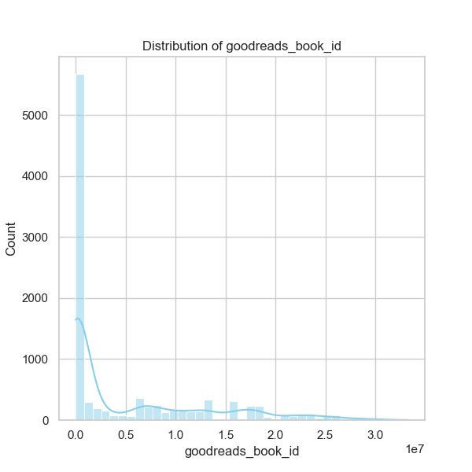

### Narrative Analysis of Goodreads Dataset

#### Overview
The analysis of the Goodreads dataset provides valuable insights into book attributes, user ratings, and publication details. This dataset consists of 10,000 entries, including features such as authorship, publication year, ISBN numbers, ratings distributions, and review counts. The data allows for a detailed exploration of reading preferences and user behaviors on the platform. Below is a summary of key insights derived from the dataset, highlighting trends, anomalies, and potential areas for further investigation.

#### Key Findings

##### Publication Trends
- **Time Range**: The dataset covers a wide range of publication years, with a mean original publication year of approximately 1982. However, there are anomalies with a minimum value of -1750, suggesting potential data entry errors or unusual cases. Around 21 entries are missing publication years, which could impact the trend analysis of when books are published.
- **Contemporary Trend**: A majority of books fall within a contemporary publication range, with the 75th percentile indicating that most books were published around or after 2011. This suggests an increasing trend in more recent publications.

##### Rating Analysis
- **Average Rating**: Books in the dataset have an average rating of 4.00, with a standard deviation of 0.25, indicating that the books are generally well-received by readers.
- **Ratings Distribution**: The distribution of ratings (ratings_1 to ratings_5) supports this trend, with positive ratings overwhelmingly outnumbering negative ones. The highest rating category (ratings_5) averages around 23,790 votes, demonstrating an engaged reader base for popular books.

##### Author Popularity
- **Top Author**: Stephen King stands out as the most prolific author in the dataset, with 60 book listings. This concentration of readership suggests a strong fanbase for specific authors and genres, providing valuable context for marketing strategies and future acquisitions by publishers.

##### Borrowing and Usage Statistics
- **Ratings Count**: There is a strong correlation between `ratings_count` and `work_ratings_count`, with a Pearson correlation coefficient near 0.995. This indicates that more popular books tend to receive more ratings, suggesting that books with higher ratings attract more attention.
- **Skewed Ratings Distribution**: The ratings distribution for ratings_1, ratings_2, and ratings_4 is negatively skewed, indicating a trend toward more favorable ratings. This pattern suggests that books evaluated tend to align with popular tastes, leading to a higher proportion of positive ratings.

##### Language Diversity
- **Language Distribution**: English is the most common language in the dataset, recorded in 6,341 entries out of the 10,000 total. This suggests a strong preference for English literature among users. While there are 25 unique language codes, further analysis of non-English books could yield more insights into language diversity.

#### Anomalies and Outliers

- **ISBN Fields**: There are missing ISBN entries in 700 records, which could indicate the absence of print editions for certain ebooks or non-traditional publishing formats. This gap should be considered when analyzing the dataset further.
- **Unusual Publication Years**: The presence of negative and implausibly old publication years in the `original_publication_year` field suggests possible data entry errors or exceptional cases that require further scrutiny.

#### Additional Analyses Suggested

1. **Clustering Analysis**: 
   - Implement clustering algorithms like K-means to explore potential groupings of books based on attributes such as average ratings, publication years, and author frequency. This could help identify distinct segments, such as genres or reader demographics, within the dataset.

2. **Anomaly Detection**:
   - Use statistical methods like Z-scores or Modified Z-Scores to detect outliers in numerical fields such as ratings and reviews. Identifying these outliers could help eliminate erroneous entries that may skew overall observations.

3. **Time Series Analysis**:
   - Analyzing trends in publication years and average ratings over time could provide deeper insights into the evolving literary landscape, particularly in relation to how readers' reception of books and market shifts impact the industry.

4. **Text Analysis of Reviews**:
   - Applying Natural Language Processing (NLP) techniques to the `work_text_reviews_count` field could help perform sentiment analysis and identify common themes or reader sentiments. This could provide valuable insights for marketing and publishing strategies.

5. **Correlation Exploration**:
   - Further correlation analysis could investigate the relationships between lesser-explored attributes, such as `books_count` versus ratings, to uncover unexpected trends or dependencies between various features.

#### Visualizations

- 
- 
- 
- 
