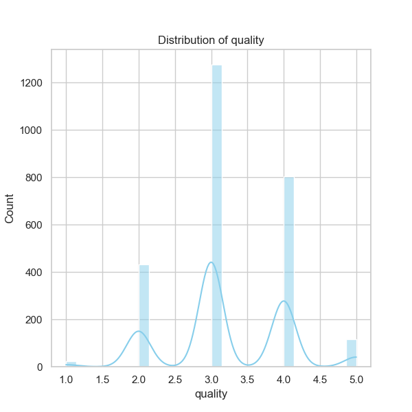

### Detailed Narrative on Media Data Analysis

#### Overview
The dataset 'media.csv' contains information related to various media items, characterized by attributes such as date, language, type, title, contributors, and metrics like overall rating, quality, and repeatability. With a total of 2,652 records, this analysis reveals insights into the nature of the media, user evaluations, and potential areas for future exploration.

#### Key Characteristics of the Data

1. **Date Distribution**:
   - The dataset spans multiple years with a total of 2,553 recorded date entries. The presence of 2055 unique dates indicates that several of these dates have multiple records, with the most frequent date being 21-May-06 (8 occurrences). Further examination of the distribution of these dates over time can help identify trends, such as seasonal variations in media releases or popularity bursts for certain years.

2. **Language**:
   - The data is primarily in English (1,306 entries), followed by other languages. This prevalence suggests a targeted audience, likely in regions where English media is dominant.

3. **Media Type**:
   - The dataset predominantly features movies (2,211 occurrences), reflecting a focused collection rather than a broader range of media types (e.g., music, TV shows). Understanding audience engagement with different media formats could further enhance content strategies.

4. **Titles and Contributors**:
   - There are 2,312 unique titles, with 'Kanda Naal Mudhal' being the most common, appearing 9 times. Interestingly, the most featured contributor is Kiefer Sutherland (48 occurrences). This indicates a potential trend towards repeat contributions from certain creators, capturing audience loyalty around specific individuals.

5. **Overall Ratings and Quality**:
   - The average overall rating stands at approximately 3.05, with quality ratings slightly higher at around 3.21. The metrics show a range typical of subjective evaluations, suggesting that while content may vary in perceived quality, there’s relatively consistent user appreciation. Notably, ratings are aggregated around lower and middle scores (e.g., 3 and lower).

6. **Repeatability**:
   - The repeatability score, averaging 1.49, indicates that many pieces are not frequently revisited (with a maximum score of 3), providing an insight into potential audience retention issues. 

#### Missing Values
There are some missing values, particularly in the 'date' and 'by' fields (99 and 262 missing entries, respectively). This could impact analyses, and it might be necessary to impute these values or exclude entries based on their significance in further analytical steps.

### Correlation Insights

The correlation matrix reveals significant relationships:

- **Overall vs. Quality (0.83)**: A strong positive correlation; improvements in content quality likely enhance overall user satisfaction.
- **Overall vs. Repeatability (0.51)**: Moderate correlation suggests some relationship between user satisfaction and their likelihood to revisit media items.
- **Quality vs. Repeatability (0.31)**: Weaker correlation indicates a limited connection.

This suggests strategies aimed at improving media quality could lead to better overall reception and higher repeat viewing metrics.

### Trends, Anomalies, and Next Steps

1. **Trends**:
   - The dominance of specific contributors and media types could reflect the preferences of a targeted audience. There is potential for developing marketing campaigns around successful titles or contributors.

2. **Outliers**:
   - Titles with extremely low overall or quality ratings could be investigated to understand the context—be it the content itself, audience misalignment, or lack of marketing.

3. **Clustering Analysis**:
   - Clustering techniques (e.g., KMeans) could be applied to segment media based on characteristics such as language, type, and ratings. This would allow deeper insights into distinct audience segments and tailor content offerings to match preferences.

4. **Anomaly Detection**:
   - Employing techniques like Isolation Forest or Z-score analysis to identify unusual patterns in ratings could help in flagging media that may require further attention or opportunities for content revamping.

### Impact on Future Decisions

- **Content Acquisition**: Insights from user ratings can drive the acquisition of new media. The focus might shift toward genres or types that resonate well with audiences, inferred from correlation analyses.
  
- **Marketing Strategies**: Understanding language and genre preferences allows for targeted marketing efforts that can increase overall engagement and retention.

- **Quality Improvement Initiatives**: With clear correlations between quality and overall ratings, efforts towards improving production standards could directly benefit user satisfaction and engagement metrics.

By leveraging these analytical insights, stakeholders can make informed decisions about content strategy, marketing approaches, and audience engagement tactics, ultimately enhancing the media offering and user experience.

